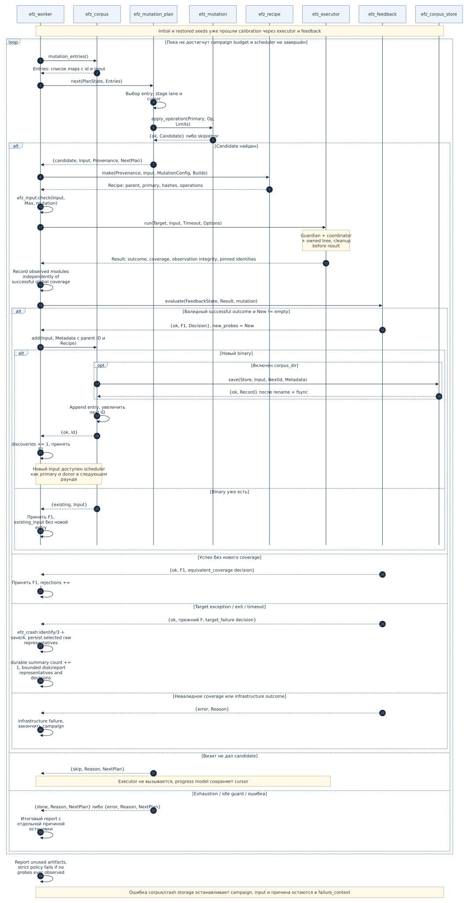
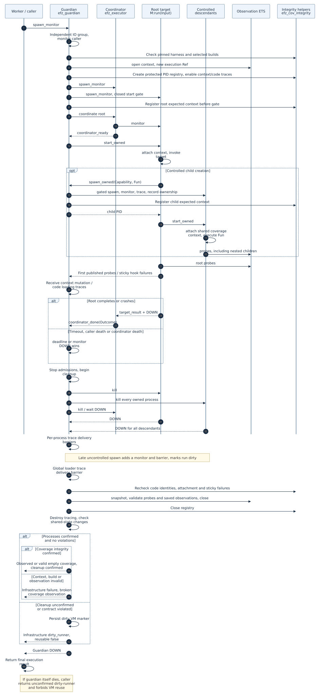

# Архитектура EFZ

Документ описывает текущий runtime EFZ по исходному коду на **13 сентября 2026 года**.
EFZ — coverage-guided фаззер на Erlang/OTP: он мутирует `binary()`, исполняет
`Module:run/1`, собирает source-instrumented coverage и возвращает успешные inputs
с новым покрытием в active corpus. Эти inputs затем доступны как родители и donors
для следующих мутаций. Runtime работает в одной BEAM VM и принимает один worker.

Описание относится к реализованной системе. Распределённое исполнение, полноценная
изоляция OTP-приложений и exact campaign resume в эту архитектуру не входят.

Назначение каждой директории и каждого файла, включая тесты, examples и архивные
материалы, описано в [карте репозитория](repository-map.md).

## Навигация

- [1. Основные модули и UML](#modules)
- [2. Процессы, supervision и владельцы состояния](#processes)
- [3. Подготовка artifacts и запуск campaign](#startup)
- [4. Замкнутый feedback loop](#feedback)
- [5. Исполнение одного input](#execution)
- [6. Coverage и принятие решения](#coverage)
- [7. Corpus и постоянное хранение](#corpus)
- [8. Scheduler, mutation и replay](#mutation)
- [9. Input limits, ошибки и завершение](#failures)
- [10. Границы изоляции и интеграции с OTP](#boundaries)
- [11. Проверки и дальнейшее чтение](#evidence)

Диаграммы доступны как готовые SVG и редактируемые Mermaid-исходники.
Использованы UML structural/class diagrams со стереотипами `module`, `gen_server`,
`process`, `ETS` и UML sequence diagrams. Это отображение модулей, процессов и
ресурсов Erlang в UML; классов ООП в реализации нет. Общая зависимость модулей не
означает отдельный процесс или асинхронный вызов. [Формат и рендеринг](diagrams/README.md).

<a id="modules"></a>
## 1. Основные модули и UML



[Открыть SVG](diagrams/modules.svg) · [Mermaid source](diagrams/modules.mmd)

Диаграмма показывает основные зависимости staged runtime. Build transform,
coverage hooks, random path и вспомогательные модули перечислены ниже, чтобы схема
оставалась читаемой. Пунктирная стрелка означает зависимость от модуля.

| Компонент | Реальные модули / entry points | Назначение и место в runtime |
|---|---|---|
| CLI | [fuzz.escript](../scripts/fuzz.escript), [efz_cli](../src/efz_cli.erl):`main/1` | Аргументы, raw seed files, поиск artifacts, вызов API и итоговый `report.term` |
| Public API | [efz](../src/efz.erl):`start/1`, `await/1`, `stats/0`, `stop/0` | Запуск приложения и campaign; ожидание отчёта; остановка |
| Application | [efz_app](../src/efz_app.erl), [efz_sup](../src/efz_sup.erl) | Корневой supervisor и lifecycle приложения |
| Campaign config | [efz_config](../src/efz_config.erl):`prepare/1` | Строгая schema, callbacks, лимиты, artifact preflight и corpus restore |
| Instrumentation | [efz_instrument](../src/efz_instrument.erl), [efz_instrument_pt](../src/efz_instrument_pt.erl) | Компиляция выбранных исходников с hooks и manifest; проверка/загрузка artifacts |
| Manifest / validation plan | [efz_cov_manifest](../src/efz_cov_manifest.erl) | Probe identities, разрешённые builds/probes и проверка observed coverage |
| Campaign coordinator | [efz_fuzzer](../src/efz_fuzzer.erl) | Создание сервисов, monitor worker, waiters `await`, итоговый report |
| Worker supervision | [efz_worker_sup](../src/efz_worker_sup.erl) | Один temporary worker; автоматического восстановления campaign state нет |
| Fuzz loop | [efz_worker](../src/efz_worker.erl):`handle_info/2` | Calibration → scheduling → mutation → execution → feedback → retain/report |
| Harness contract | [efz_target](../src/efz_target.erl), пользовательский `Module:run/1` | Принимает binary; адаптирует его к реальному parser/target |
| Executor | [efz_executor](../src/efz_executor.erl):`run/4` | API, root outcome, ожидание final result и guardian DOWN |
| Lifecycle guardian | [efz_guardian](../src/efz_guardian.erl) | Независимое владение root/descendants, deadline, DOWN/trace barriers, snapshot и dirty-runner policy |
| Coverage context / hooks | [efz_cov](../src/efz_cov.erl), [efz_cov_rt](../src/efz_cov_rt.erl) | ETS конкретного исполнения и `hit/1` из инструментированного кода |
| Coverage integrity | [efz_cov_integrity](../src/efz_cov_integrity.erl) | Pins harness/builds, protected PID/context registry, sticky context/code-load failures и observation states |
| Feedback | [efz_feedback](../src/efz_feedback.erl):`evaluate/3` | Чистая функция классификации и разности coverage; состояние хранится у worker |
| Active corpus | [efz_corpus](../src/efz_corpus.erl) | Entries, integer IDs, дедупликация и выдача inputs scheduler; опциональный persist |
| Durable corpus | [efz_corpus_store](../src/efz_corpus_store.erl) | SHA-256 entries, metadata, build policy, проверка и restore |
| Staged planner | [efz_mutation_plan](../src/efz_mutation_plan.erl):`prepare/2`, `new/1`, `next/2` | Scheduler, stage lanes, lazy cursors, bounded visits и явное RNG state |
| Mutation operators | [efz_mutation](../src/efz_mutation.erl) | Применение конкретных операций к binary с проверкой bounds |
| Dictionary | [efz_dictionary](../src/efz_dictionary.erl) | Загрузка/нормализация tokens и dictionary identity при подготовке |
| Random mode | [efz_mutator](../src/efz_mutator.erl), [efz_mutator_random](../src/efz_mutator_random.erl):`mutate/2` | Альтернативный production path через callback; использует тот же executor/feedback |
| Recipe / replay | [efz_recipe](../src/efz_recipe.erl), [efz_replay](../src/efz_replay.erl), [efz_replay_cli](../src/efz_replay_cli.erl) | Exact bytes, provenance, EFZR codec, регенерация и явный execution replay |
| Input contract | [efz_input](../src/efz_input.erl) | Campaign byte limit, проверка binary и bounded file reads |
| Crash disk policy | [efz_crash_store](../src/efz_crash_store.erl) | Durable occurrence count, bounded representatives, writer lock и EFZG index |
| Crash artifacts | [efz_crash](../src/efz_crash.erl):`save/4` | Occurrence ID, normalized signature, bounded representatives, атомарные raw input/result/recipe/expectation |
| Filesystem operations | [efz_fs](../src/efz_fs.erl) | Structured IO errors, write/fsync/close, atomic file/group publication |
| Statistics | [efz_stats](../src/efz_stats.erl) | Calibration/execution/discovery/crash/timeout/infrastructure counters |

`fixtures/` и `test/` содержат targets и проверки. `examples/` содержит готовые
harness/campaign scenarios; простой пример включён в `rebar.config` как source
root. `bench/` — отдельные измерительные драйверы, не scheduler приложения.
`efz_scripted_mutator` используется в части старых тестов, но не является default
и не участвует в проверке реального staged lineage.

<a id="processes"></a>
## 2. Процессы, supervision и владельцы состояния



[Открыть SVG](diagrams/processes.svg) · [Mermaid source](diagrams/processes.mmd)

Чёрный ромб обозначает supervisor child либо ресурс, принадлежащий процессу;
точное отношение подписано. Сплошная линия `start_link / shutdown` — обычная OTP
link-связь. Пунктир `spawn_monitor` — создание и наблюдение, **не supervision**.
`ExecutionGuardian`, `ExecutionCoordinator`, `TargetProcess`, `ValidationPlan`, `ExecutionCoverage` —
обозначения runtime-ролей на диаграмме, не названия новых Erlang-модулей.

```text
application efz
└── efz_sup                       supervisor: one_for_all, intensity 0
    └── efz_fuzzer                temporary child, gen_server
        ├── efz_corpus            start_link из init/1
        ├── efz_stats             start_link из init/1
        └── efz_worker_sup        start_link; one_for_one, 5 restarts / 10 sec
            └── efz_worker       один temporary child
                └── guardian     spawn_monitor; независимый I/O group leader
                    ├── coordinator  классификация root
                    ├── root         gated target process
                    └── descendants  все через efz_target:spawn/1, spawn_link/1
```

Вложенность под `efz_fuzzer` показывает lifecycle ownership: **сам `efz_fuzzer`
не является supervisor**. Он устанавливает `trap_exit`, создаёт три связанных
сервиса и при завершении останавливает их в порядке worker supervisor → stats →
corpus. Worker дополнительно отслеживается monitor.

При падении worker campaign возвращает `{infrastructure_failure,{worker_down,Reason}}`.
Worker не перезапускается: `restart => temporary` важнее разрешённой restart
intensity его supervisor. При `EXIT` связанного сервиса `efz_fuzzer` прекращает
campaign. Эти аварийные пути не эквивалентны нормальному возврату target exception.

| Состояние | Владелец | Представление и lifetime |
|---|---|---|
| Active queue и `next` ID | `efz_corpus` | Список maps в состоянии `gen_server`; до остановки campaign |
| Global coverage | `efz_worker` | `feedback.global`: Erlang `sets` и pinned build map |
| Staged cursors / RNG / pending round | `efz_worker` | `mutation_state`, возвращаемый `efz_mutation_plan`; не отдельный процесс |
| Validation allowlist | `efz_worker` в default prepared mode | Безымянная `protected` ETS `efz_coverage_plan`; исчезает при смерти владельца |
| Coverage текущего input | Execution guardian | Новая безымянная `public` ETS `efz_execution_coverage`; удаляется после исполнения |
| Execution context | Root и controlled descendants | Ключ `'$efz_execution_context'` в process dictionary; содержит ref, ETS handle, owner PID |
| Integrity registry и evidence | Execution guardian | Protected ETS `efz_coverage_observers`: PID → expected context, pins; guardian state хранит attachment, увиденные probes и первую ошибку |
| Lifecycle, monitors, trace barriers | `efz_guardian` | Один execution; final result после завершения всех supported processes |
| Dirty VM marker | `persistent_term` | `{efz_guardian, dirty_runner}`; не сбрасывается при `efz:stop/0` |
| Runtime counters | `efz_stats` | Map в `gen_server`; `inc/1` синхронный |
| Decisions, crash representatives, failure context | `efz_worker` | Report state; полные данные только для значимых событий/ограниченного trace |
| Report и callers `await` | `efz_fuzzer` | `report` и `waiters`; report доступен до `stop` |
| Persisted corpus / findings | Файловая система | Сохраняются после остановки EFZ/VM |

Global coverage не хранится в ETS observation table. Нет global «current input»
или `persistent_term` cache для feedback. После завершения finite campaign worker
и validation plan остаются живыми до `efz:stop/0`.

<a id="startup"></a>
## 3. Подготовка artifacts и запуск campaign

### Instrumentation до запуска

```text
обычный .erl + выбранные modules + compiler options
→ efz_instrument:compile/2
→ efz_instrument_pt:parse_transform/2
→ instrumented .beam с efz_manifest attribute + .efz-manifest sidecar
→ efz_instrument:preflight/1
→ проверенные manifests и загруженные модули
```

Transform добавляет hooks в clause/outcome bodies, не в patterns или guards.
Build namespace зависит от нормализованных форм, значимых compile options и
идентичности toolchain. Probe ordinal сопоставляется через manifest с function,
arity, source location и structural location. Разные builds имеют разные полные
probe identities; один ordinal сам по себе не идентифицирует coverage.

`efz_instrument` управляет include paths, macros и временными code paths. Только
facade пишет artifacts; transform работает с формами и не выделяет runtime ETS
или campaign state. Порядок с произвольными дополнительными parse transforms не
поддерживается: такие transforms отклоняются. Embedded manifest сверяется с
безопасно декодированным sidecar; сравниваются данные, а не порядок ETF map bytes.

### Campaign startup

1. `efz_cli:main/1` читает аргументы и seed files как raw binaries, находит
   artifacts, проверяет доступность output directory. Сам CLI не запускает
   compiler автоматически и не реализует fuzz loop.
2. `efz:start/1` запускает application и добавляет temporary `efz_fuzzer` child
   через `supervisor:start_child/2`.
3. `efz_fuzzer:start_link/1` вызывает `efz_config:prepare/1` **до** создания
   campaign `gen_server`: schema, input bounds, mutation settings, preflight,
   `code:ensure_loaded/1` и проверка экспорта `run/1`. Arbitrary MFA не принимается.
4. При `corpus_dir` загружаются и проверяются saved entries. Initial и restored
   inputs объединяются с дедупликацией по content identity.
5. `efz_fuzzer:init/1` создаёт corpus, stats, worker supervisor. Corpus назначает
   новые integer IDs и при необходимости сохраняет initial seeds.
6. Worker готовит validation plan и staged state, получает `efz_corpus:all()` и
   отправляет себе `iterate`.
7. Calibration исполняет **каждый** initial/restored seed через executor и
   feedback. Затем начинается mutation phase.

Calibration сейчас — один проход для инициализации coverage, а не многократный
анализ стабильности или поиск flaky probes. Даже `max_iterations => 0` выполняет
calibration; `max_iterations` ограничивает только mutation executions.

| Входной контракт | Значение |
|---|---|
| Harness | `Module:run(binary()) -> term()`; отдельный адаптер необязателен |
| Target config | `target => Module`; `function` / `arity` отвергаются |
| Input | Raw `binary()`, без string decoding или автоматической term-конверсии |
| `max_input_bytes` | Верхнеуровневый campaign key: default 4096, inclusive 0..1048576 |
| Worker count | Только `workers => 1` |
| API defaults | `mutation_mode => random`, `max_iterations => infinity` |
| CLI defaults | Staged, 1000 mutation executions |
| Coverage defaults | `automatic`, backend `ets`, validation `prepared` |

Лимит размера применяется к seeds, restore, обоим mutation modes, исполнению,
crash input и replay. Старый вложенный `mutation.max_input_bytes` не является
campaign option; в нормализованный planner config лимит передаёт `efz_config`.
Полная schema и команды запуска: [CLI](cli.md), [input/storage contract](input-and-storage.md).

<a id="feedback"></a>
## 4. Замкнутый feedback loop



[Открыть SVG](diagrams/feedback-loop.svg) · [Mermaid source](diagrams/feedback-loop.mmd)

Основной staged call path:

```text
efz_worker:handle_info(iterate, State)
→ efz_corpus:mutation_entries/0
→ efz_mutation_plan:next(PlanState, Entries)
→ efz_mutation:apply_operation(Primary, Operation, Limits)
→ efz_recipe:make(Provenance, Input, MutationConfig, Builds)
→ efz_executor:run(TargetModule, Input, Timeout, ExecutorOptions)
→ efz_feedback:evaluate(FeedbackState, Result, mutation)
→ efz_corpus:add(Input, Metadata)                 [new successful coverage]
→ efz_corpus_store:save(Store, Input, Id, Meta)    [если corpus_dir включён]
→ append в entries, ответ {ok, Id}
→ worker принимает FeedbackState1 и отправляет себе iterate
→ будущий efz_mutation_plan:next/2 видит новую entry
```

Diagram показывает control flow; не все стрелки являются Erlang messages.
`mutation_entries/0` и `add/2` — синхронные `gen_server:call`; planner, mutation,
recipe и feedback — обычные вызовы в процессе worker. Durable save выполняется
в процессе corpus и должен завершиться перед append/ack. Его ошибка не изменяет
active queue. Worker принимает новое feedback state после успешного retain path.

Успешно найденный input получает новый integer ID. `Metadata.parent` и
`Recipe.parent` указывают ID его primary. Recipe также содержит `primary` binary и
`primary_id = SHA256(primary)`. Сохранение input на диск само по себе не означает
включения в очередь: эту связь обеспечивает append в `efz_corpus:add_checked/3`.

Новая entry не обязана стать **самой следующей** мутацией. Scheduler завершает
текущий снимок раунда и включает новые IDs в будущий раунд. Это предотвращает
вытеснение старых entries непрерывным ростом corpus. Donors берутся из актуальных
entries active corpus, включая discoveries.

В [efz_feedback_loop_tests](../test/efz_feedback_loop_tests.erl) реальный dictionary
insertion с отдельными tokens `A`, `B`, `C` доказывает цепочку
`<<>> → <<"A">> → <<"AB">> → <<"ABC">>`, parent IDs, exact harness delivery,
new probes и replay в свежей VM. Нет scripted outputs, mock corpus или mock coverage.

<a id="execution"></a>
## 5. Исполнение одного input



[Открыть SVG](diagrams/executor.svg) · [Mermaid source](diagrams/executor.mmd)

`efz_executor:run/4` создаёт независимый `efz_guardian`. Guardian владеет root,
controlled descendants, observation ETS, deadline и trace session. Отдельный
coordinator классифицирует root result и `DOWN`. Root начинает работу лишь после
подтверждения установки monitor. Смерть coordinator запускает cleanup у guardian.

Используются отдельные `Request` для ответа caller и execution `Ref` для coverage.
Final result публикуется после kill/drain всех owned processes, per-process trace
barriers, snapshot/validation, удаления ETS и проверки признаков загрязнения VM.
Caller дополнительно ждёт нормальный `DOWN` guardian перед возвратом из `run/4`.

| Взаимодействие | Сообщение / механизм |
|---|---|
| Продолжение fuzz loop | `self() ! iterate` в worker |
| Worker ↔ corpus | `gen_server:call` для entries/add |
| Target → coordinator | `{target_result, Ref, TargetPid, Outcome}` |
| Coordinator → guardian | `{coordinator_ready, Pid}`, затем `{coordinator_done, Pid, Outcome}` |
| Controlled parent → guardian | `{spawn_owned, Capability, ParentPid, Request, Fun}` |
| Guardian → parent → child | `{Request,{ok,Pid}}`, затем `{start_owned,Capability}` |
| VM → guardian | `DOWN` каждого owned процесса и `trace_delivered` после его смерти |
| Broken active ETS → guardian | `{efz_cov_failure, Ref, invalid_table}` |
| Guardian → worker | `{Request, GuardianPid, Result}` и guardian `DOWN` |
| Worker → campaign coordinator | `{campaign_done, WorkerPid, Report}` |

Root вызывает прямой `M:run(Input)`. Return term, включая `{error,Reason}`, остаётся
успехом; caught error/throw дают crash со stack, exit — `{exit,Reason}`. При timeout
или root completion guardian прекращает admission и убивает оставшиеся descendants
через `kill`, независимо от links и `trap_exit`. После этого ждёт подтверждения.

`cleanup.status => confirmed` и `runner_reusable => true` означают завершение
поддержанного lifecycle без обнаруженных нарушений. Ошибка очистки или общего
состояния даёт `dirty_runner`, блокирующий новые targets в этой VM даже после stop.
При смерти caller guardian выполняет cleanup без получателя результата. Timeout
`efz:await/1` прекращает только ожидание, не campaign. Полный contract, supported
spawn API и границы автоматических проверок: [execution isolation](execution-isolation.md).

<a id="coverage"></a>
## 6. Coverage и принятие решения

Метрика — **`clause_outcome_probe`**: custom points в clause/outcome bodies.
Это не OTP native coverage, не `cover`, не bitmap edge coverage и не hit-count
buckets. Полная identity автоматического probe:

```erlang
{ModuleAtom, BuildSHA256, ProbeIdInteger}
```

Каждый hit сверяет process-dictionary context с protected PID registry и
синхронно обращается к observation ETS. Backend `ets` делает `insert_new` для `{ {probe, Id} }`.
`ets_member` сначала проверяет наличие элемента во внешней ETS и пропускает
повторную вставку. Оба сохраняют точный набор identities, не требуют финального
flush из target и проверяют доступность таблицы на каждом hit. Первый insert
уведомляет guardian; потеря опубликованного observation обнаруживается при snapshot.

После завершения root и descendants guardian делает `snapshot/1` и validation. Default
`prepared` использует неизменяемую protected ETS allowlist worker. В режиме
`per_execution` используется `validate_observed/3` и manifests. Референсный путь
оставлен для differential tests и измерений, не как второй coverage semantics.

Точное решение находится в [efz_feedback:evaluate/3](../src/efz_feedback.erl):

```text
Result.builds должен совпасть с pinned FeedbackState.builds.
Если coverage_status == ok и outcome == {ok, ReturnValue}:
    New = Observed − Global
    Global1 = Global ∪ Observed
    calibration: reason = seed_calibration
    mutation + New пуст: reason = equivalent_coverage
    mutation + New непуст: reason = new_coverage
Target failure: global coverage не меняется; reason = target_failure.
Coverage / infrastructure failure: error; worker останавливает campaign.
```

Нет отдельного coverage collector server и нет общей observation table для
нескольких inputs. Сериализация одного worker устраняет race «два worker
одновременно проверили и добавили probe» в текущей конфигурации. Она не доказывает
готовность к multi-worker scheduling; `workers > 1` отвергается config.

Неактивный hook без context допустим только вне executor-owned process.
Стирание/подмена context, caught hook exceptions, потеря опубликованных probes и
replacement pinned module дают infrastructure failure. Отдельные trace events
сохраняют evidence даже после восстановления context/BEAM. Это correctness guard,
а не защита от намеренной подделки внутренних протоколов или изменения EFZ.
`valid_empty_coverage` означает целое наблюдение без probes. Campaign diagnostic
показывает unused artifacts; `coverage_policy => strict` запрещает успешное
завершение campaign без единого probe, но не останавливает её на zero-hit calibration.
Подробности: [integrity](coverage-integrity.md), [syntax и mapping](coverage.md).

<a id="corpus"></a>
## 7. Corpus и постоянное хранение

Active corpus хранит entries вида:

```erlang
#{id => QueueId,
  input => ExactBinary,
  metadata => Metadata,
  added_at => SystemTimeMilliseconds}
```

В runtime дедупликация `efz_corpus:add/2` сравнивает exact bytes. Staged cursor
identity и persistent content identity используют SHA-256. Новые runtime IDs
выделяет единственный corpus process; существующий binary не получает новый ID.
Без `corpus_dir` initial seeds сохраняют переданный список, включая повторы;
объединение и дедупликация initial/restored inputs выполняются при durable startup.
Random mode выбирает случайную entry через `select/0`, staged — запрашивает
`mutation_entries/0` и сам выполняет scheduling.

Если задан `corpus_dir`, сохраняются initial seeds и successful new-coverage
inputs. Target failures туда не добавляются как discoveries. Сама запись initial
seed не доказывает успешное исполнение: persist предшествует calibration.

```text
CORPUS_DIR/
  INPUT_SHA256/
    input                    exact raw bytes
    metadata                 EFZC v1 envelope + checksum
  .tmp-RANDOM/                незавершённая публикация

CRASH_DIR/
  SIGNATURE_SHA256/
    summary                  EFZG: durable count + selected IDs/hashes
    .lock/                   exclusive writer, только во время записи
    OCCURRENCE_ID/            выбранный representative
      artifact.input         exact triggering bytes
      artifact.term          полный raw Reason/stack, metadata, input limit
      artifact.replay        EFZX: expected build/harness/hash/signature
      artifact.recipe        EFZR, только когда recipe доступна
      manifest               version + sizes + checksums файлов occurrence
    .tmp-RANDOM/              staging, не опубликованный finding
```

Durable metadata содержит content hash, input size, historical queue ID, origin,
parent content hash/ID, discovery probes, target/build identity и recipe при
наличии. Запись проходит через temporary directory, file fsync/close, directory
fsync, atomic rename и fsync родителя. Повреждённая опубликованная entry вызывает
ошибку; `.tmp-*` corpus entries дают явную диагностику interrupted write.

При restore inputs заново включаются в active corpus и проходят calibration.
`corpus_build_policy => reject` по умолчанию запрещает несовпадение identity;
`recalibrate` разрешает повторное использование с диагностикой и новой calibration.
Не восстанавливаются scheduler cursors, RNG, global coverage, старые integer IDs
и порядок выполнения. Это reusable persistent corpus, **не checkpoint/resume**.

EFZC corpus metadata, EFZR recipe и manifest инструментированного модуля — разные
форматы. Crash `artifact.term` может содержать runtime diagnostic terms и не
используется как безопасный recipe import. Формат и проверки: [corpus](corpus.md),
[replay](replay.md), [atomic storage](input-and-storage.md).

<a id="mutation"></a>
## 8. Scheduler, mutation и replay

В staged mode worker хранит `efz_mutation_plan` state: cursors по
`{InputSHA256, ConfigId}`, stage lane, pending entry IDs, `exsplus` RNG state и
progress counters. Все mutations заранее не материализуются.

Default lanes: `bitflip`, `byteflip`, `arithmetic`, `boundary`,
`dictionary_insert`, `dictionary_overwrite`, `havoc`, `splice`. Lanes чередуются
по entries и раундам; это не обязательное полное исчерпание всех deterministic
stages до первого havoc. Один visit возвращает максимум один candidate, а число
попыток внутри visit ограничено config. Empty/nonfitting/no-op операции могут
вернуть `skip`, сохраняя продвинутый cursor.

Progress считается при генерации candidate **или продвижении finite cursor**.
`max_idle_visits` не завершает scheduler, пока остаётся finite deterministic work.
После исчерпания deterministic work idle guard применяется только после threshold
и полного обхода всех lanes каждого текущего content без progress. Corpus growth
сбрасывает idle accounting, сохраняя cursors, RNG и незавершённый раунд.

Random mode вызывает `Mutator:mutate(Primary, #{iteration, max_input_bytes})`;
default — `efz_mutator_random`. Это реальный отдельный способ генерации, который
сходится со staged mode на worker → executor → feedback → corpus. Он не получает
staged cursors и автоматически не создаёт staged recipes.

Recipe содержит primary bytes/hash, parent ID, concrete operations, donor bytes
для splice, output size/hash, input/operator limits, config/dictionary IDs,
versions, builds и диагностический initial RNG seed. Для воспроизведения не нужны
старый corpus, dictionary file или повторный запуск RNG.

- `regenerate/1` восстанавливает bytes под лимитом, записанным в recipe.
- `regenerate/2` дополнительно принимает лимит текущего campaign и проверяет
  primary/donors/intermediate values/output.
- `execute/5` / `execute_file/5` требуют явные target/artifacts/builds и
  `expected_harness`, создают свежий validation plan и используют тот же executor.
- `efz_replay:run/6` сверяет input hash, builds и harness, затем сравнивает signature.
- `scripts/replay.escript --input/--recipe` выполняет этот verified replay;
  старый позиционный режим только регенерирует bytes. Target всегда задаёт пользователь.

Подробные operator contracts и budgets: [mutations](mutations.md).

<a id="failures"></a>
## 9. Input limits, ошибки и завершение

`efz_input` задаёт единый byte contract. `0` допускает только `<<>>`; `max`
допустим; `max + 1` отклоняется без truncation. CLI/restore/replay читают не более
лимита плюс одного байта для обнаружения oversize. Random mutator учитывает
свободное место, а worker и executor дополнительно проверяют candidate.

| Report status | Причина |
|---|---|
| `completed` | Выполнен mutation execution budget; calibration учтена отдельно |
| `{mutation_exhausted,mutation_exhausted}` | Исчерпана конечная deterministic search space без random lanes |
| `{mutation_stopped,idle_budget_exhausted}` | Random/progress guard; это не доказательство математического exhaustion |
| `{infrastructure_failure,Reason}` | Ошибка mutation/input, coverage или storage в контролируемом runtime path |
| `{infrastructure_failure,{worker_down,Reason}}` | Неожиданное завершение worker; fallback report от `efz_fuzzer` |

`efz_crash:save/4` возвращает `{ok,Crash}` или `{error,ErrorMap}`. Filesystem error
содержит `operation`, `path`, `reason`, `input_hash`, `crash_fingerprint`; при
необходимости добавляются staging/group path и secondary cleanup/close errors.
Первая ошибка не заменяется ошибкой cleanup.

Каждый выбранный representative публикуется отдельной атомарной директорией. Input identity —
SHA-256 exact bytes; occurrence ID — random 128 bits; signature — SHA-256
нормализованных class/Reason/stack; group ID равен signature. `Crash.path` указывает
префикс `SIGNATURE/OCCURRENCE/artifact`. `artifact.term` сохраняет полный raw Reason
и stack. `artifact.replay` содержит проверяемую identity отдельно от диагностик.

Signature v2 берёт только module/function/arity первых пяти target frames,
исключая paths/lines и frames runtime. `crash_policy.reason` задаёт `category`
(default), `exact` или `ignore`; runtime pid/ref/port/fun identities нормализуются
даже при `exact`. Hash вычисляется по явно упорядоченной структуре, устойчивой к
порядку atoms/maps в новой VM. Report хранит count `occurrences` и по умолчанию
три representative inputs разных hashes на signature. Crash decisions добавляются
только для этих representatives. Тот же `max_representatives` ограничивает disk
посредством `efz_crash_store`: первые N различных hashes на signature, immutable
raw input/Reason/recipe/expectation, атомарный `summary` со счётчиком всех committed
occurrences. Summary сохраняет cap между VM. `durable_occurrences` отделён от
счётчика текущей campaign; `storage` различает saved/duplicate/limit_reached.
При limit_reached новый input не получает disk artifact; его текущий report может
сохранить в bounded representatives. Legacy/unindexed/corrupt группы и оставшийся
writer lock дают явную ошибку, а не сброс счётчика. Старые archives не удаляются.

При runtime storage failure worker увеличивает `infrastructure_failures`, сохраняет
exact input, result/stack, metadata и recipe в `failure_context` и завершает
campaign. `unique_crashes` считает signatures, включая unsaved;
`crash_occurrences` считает все target failures, включая timeout и повторы.
Если испорчена только recipe, raw input/result/expectation публикуются без неё,
но campaign получает явную infrastructure error; `saved_artifact` указывает
exact-input representative, когда он сохранён в пределах cap.

Stats сохраняют `primary_infrastructure_failure`. Fuzzer получает текущий exact
input до вызова executor; при `worker_down` увеличивает infrastructure counter и
включает последний полученный context в fallback report. Fallback не восстанавливает
потерянные worker cursors или partial crash groups. Coordinator loss не маскируется
пустым build map, ошибкой coverage или dirty cleanup: outcome сохраняет первичную
infrastructure cause, а `cleanup` / `runner_reusable` описывают вторичный lifecycle
status. При потере guardian после reply executor также сохраняет первичную
ошибку, вторичный `guardian_failure` и предыдущие `execution_evidence`; финальный
cleanup становится unconfirmed. Dirty runner повторно использовать нельзя. Startup failures возвращаются
из `efz:start/1` как error, а не как завершённый campaign report.

`efz_cli` атомарно пишет `OUT/report.term`. Если запись report тоже не удалась,
CLI увеличивает infrastructure counter и включает in-memory report в diagnostic.
Коды выхода: `0` — обычная остановка (в том числе с найденными target crashes),
`2` — invalid invocation/config, `1` — runtime infrastructure/report storage error.

<a id="boundaries"></a>
## 10. Границы изоляции и интеграции с OTP

Поддержанная модель — **synchronous binary harness with controlled descendant
lifecycle**. `efz_target:spawn/1` и `spawn_link/1` передают context и создают owned
процессы до открытия start gate. Guardian не обходит произвольные links.

| Область | Гарантия / ограничение |
|---|---|
| Root и controlled descendants | Общий execution coverage; `DOWN` всех процессов до normal final result |
| Обычный local spawn | Обнаружение tracing, cleanup найденных процессов, dirty-runner outcome |
| Смерть caller / coordinator | Guardian остаётся владельцем cleanup, включая application cancellation |
| Смерть guardian / cleanup deadline | Unconfirmed cleanup, infrastructure/dirty-runner; VM не reuse |
| Owned ETS и registrations | Уходят вместе с процессами; escaping resources делают runner dirty |
| `persistent_term` / application env | Сравнение before/after; изменения запрещают reuse, rollback не выполняется |
| Запись в существующую внешнюю ETS | Вне модели; нет полной автоматической проверки, требуется explicit dirty declaration / disposable VM |
| Arbitrary OTP applications, ports/NIF, remote work, filesystem effects | Не изолируются этим backend; следующий backend — disposable Erlang VM |
| Instrumentation / code loading | Pinned harness/builds; hot replacement и context corruption диагностируются как infrastructure. Подделка EFZ protocol/tracing вне защищаемой модели |
| Campaign concurrency | Один worker и один execution в VM; второй caller получает runner_busy |
| Stability | Calibration остаётся одним проходом; recipe determinism не гарантирует target determinism |

Shared-state snapshots диагностируют часть нарушений, но не превращают VM в
sandbox. Для допустимых process-local ресурсов `A → dirty → A` сохраняет outcome
и coverage. Для VM-global mutation третий `A` блокируется до исполнения.
Подробная [политика по каждому ресурсу и regression evidence](execution-isolation.md).

<a id="evidence"></a>
## 11. Проверки и дальнейшее чтение

| Архитектурная связь / гарантия | Проверка |
|---|---|
| Controlled descendants, guardian failures, shared-state policy | [efz_isolation_tests](../test/efz_isolation_tests.erl) |
| Реальная mutation → coverage → retain → новый parent | [efz_feedback_loop_tests](../test/efz_feedback_loop_tests.erl) |
| Persisted discovery становится parent в другой VM | [efz_durable_tests](../test/efz_durable_tests.erl) |
| Finite progress, 256 seeds и `max_idle_visits` | [efz_mutation_tests](../test/efz_mutation_tests.erl), [efz_phase3_tests](../test/efz_phase3_tests.erl) |
| External harness и raw CLI ingestion в fresh VM | [efz_cli_tests](../test/efz_cli_tests.erl) |
| Coverage identity, exception/timeout и cleanup | [efz_phase2_tests](../test/efz_phase2_tests.erl), [efz_coverage_SUITE](../test/efz_coverage_SUITE.erl) |
| Coverage integrity и zero-hit policy | [efz_integrity_tests](../test/efz_integrity_tests.erl), fresh VM policy tests в [efz_cli_tests](../test/efz_cli_tests.erl) |
| `ets` / `ets_member`, prepared/reference equivalence | [efz_backend_tests](../test/efz_backend_tests.erl) |
| Late guardian death и bounded persistent crash store | [efz_crash_retention_tests](../test/efz_crash_retention_tests.erl) |
| Crash grouping, raw diagnostics, verified replay, 1000 occurrences | [efz_crash_tests](../test/efz_crash_tests.erl) |
| Recipe operators и fresh-VM replay | [efz_recipe_tests](../test/efz_recipe_tests.erl), [efz_phase3_tests](../test/efz_phase3_tests.erl) |
| Corrupt/interrupted corpus entries, build policies | [efz_corpus_store_tests](../test/efz_corpus_store_tests.erl) |
| Bounds, storage failure, exact input в report | [efz_limits_tests](../test/efz_limits_tests.erl) |

Эта документация сама по себе не является новым test run. Последние сохранённые
результаты runtime-проверок доступны локально в `_build/limits-checks/`; diagrams
проверяются отдельно Mermaid renderer. Для полной проверки кода:

```sh
rebar3 compile
rebar3 eunit
rebar3 ct
rebar3 xref
rebar3 dialyzer
```

Дополнительные документы:

- [CLI и campaign schema](cli.md), [coverage contract](coverage.md),
  [ADR об automatic coverage](adr/0002-automatic-coverage.md).
- [Mutation stages](mutations.md), [replay](replay.md),
  [durable corpus](corpus.md), [input/storage contract](input-and-storage.md).
- [Phase 2 validation](phase2-validation.md),
  [Phase 2.1 performance](phase2.1-performance.md), [Phase 3 validation](phase3-validation.md).
- [Calibration readiness audit](calibration-readiness.md) — отдельное исследование
  стабильности и границ execution context, не реализованный calibration algorithm.
- [Исторический технический аудит](technical-audit-2026-09-12.md) — состояние на
  момент аудита; исправления после него описаны текущим кодом и документами выше.

## P0 runtime diagnostics

Optional `runtime_oracles` joins the existing pipeline. `efz_runtime_config`
validates one shared policy; worker repeats selected bytes through executor and
`efz_stability` compares bounded snapshots. Repeats never call feedback, corpus
selection or the mutation planner. Original retention remains unchanged.
Guardian starts `efz_runtime` sampler, publishes admitted PID membership, records
child DOWN evidence, and kills the sampler alongside cleanup. It never polls
process/ETS metrics in the deadline path. Result `runtime_observations` is separate
from outcome. `efz_runtime_store` bounds/deduplicates independent artifacts;
`efz_replay:runtime/4` delegates compatible verification to `efz_runtime_replay`.
The [diagnostic contract](runtime-diagnostics.md) specifies semantics and bounds.
