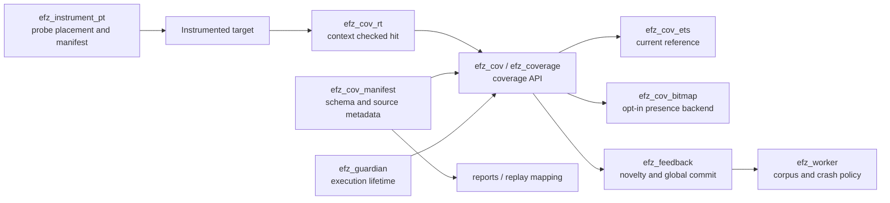

# Bitmap backend for EFZ coverage

Status: opt-in implementation for automatic presence coverage on OTP 27.0.
The existing ETS backend remains the default, reference and rollback path.
The [v1 implementation report](coverage-bitmap-implementation-report.md) preserves
the first baseline; current reuse, seal, and measurements are in the
[v2 follow-up](coverage-bitmap-v2-results.md).

## 1. Current implementation, traced through code

| Boundary | Current owner and evidence |
| --- | --- |
| Instrumentation selection | [`efz_instrument:compile_target/2`](../src/efz_instrument.erl) passes `{parse_transform, efz_instrument_pt}` to `compile:noenv_file/2`; [`efz_instrument:preflight/1`](../src/efz_instrument.erl) loads selected artifacts. |
| Probe placement and metadata | [`efz_instrument_pt:parse_transform/2`, `body/5`, `probe/4`](../src/efz_instrument_pt.erl) prepend a hit to clause/outcome bodies, number probes from 1 per module compilation, embed a manifest and emit `efz_cov_rt:hit({M,B,Id})`. Patterns and guards do not get probes. The BuildId is SHA-256 over the transform version, OTP release, compiler MD5, canonical forms and identity options. |
| Manifest validation | [`efz_cov_manifest:validate/1`, `identities/1`, `prepare/2`](../src/efz_cov_manifest.erl) check schema, unique module-local IDs and structural locations, and prepare the allowed exact identities. A `ProbeId` is **module-local**, not globally unique; the observation key is `{Module, BuildId, ProbeId}`. |
| Runtime hit and execution storage | [`efz_cov_rt:hit/1`](../src/efz_cov_rt.erl) checks the expected context, then [`efz_coverage:hit/2`](../src/efz_coverage.erl) dispatches to [`efz_cov_ets:hit/2`](../src/efz_cov_ets.erl) or [`efz_cov_bitmap:hit/2`](../src/efz_cov_bitmap.erl). Default presence mode uses `ets:insert_new` into a fresh public table; `ets_member` checks membership first. Opt-in `hit_count` uses `ets:update_counter/4`; bitmap presence uses unsigned atomics and CAS. First hits notify the guardian. [`efz_cov`](../src/efz_cov.erl) is the public compatibility API; `reset_local/0` attaches a fresh context in the caller, not a campaign-global reset. |
| Context and isolation | [`efz_guardian:start/6`, `admit/2`, `cleanup/2`, `finish/2`](../src/efz_guardian.erl) own the table and context `{efz_context,1,Ref,Storage,Owner}` for one execution. The root and children created through [`efz_target:spawn/1`, `spawn_link/1`](../src/efz_target.erl) pass an admission gate; each process explicitly attaches the shared context before target code starts. Ordinary `spawn` does not inherit it and is treated as uncontrolled. Multiple admitted processes **can write the same testcase coverage**. [`efz_cov_integrity:expected/0`, `check/1`](../src/efz_cov_integrity.erl) compare a protected PID registry to the process dictionary. |
| Stable result | [`efz_executor:invoke/4`, `coverage/3`](../src/efz_executor.erl) classify the root result. The guardian stops admission, kills remaining owned processes and coordinator, waits for `DOWN` plus trace barriers, then seals compact successful bitmap coverage or takes an exact snapshot for legacy/diagnostics. If cleanup cannot be confirmed, it marks the runner dirty; an abnormal guardian exit also retires it. This is the present *controlled descendant* contract, not arbitrary OTP-process isolation. |
| Comparison and policy | [`efz_feedback:evaluate/3`](../src/efz_feedback.erl) checks build map, outcome and coverage status. Only valid `{ok, _}` outcomes merge observed probes into the campaign exact set; calibration also merges successful coverage. A crash/exit/timeout can carry observed coverage in its result, but does not update global coverage. In `hit_count` mode successful results also compare and merge count-bucket features. |
| Corpus and failure artifacts | [`efz_worker:execute_checked/4`, `execute_result/6`, `retain/2`, `record_failure/4`](../src/efz_worker.erl) run each seed or mutation, evaluate feedback, retain successful new coverage (`new_coverage`, `new_probe`, or `new_hit_count`), and separately save/deduplicate crashes and timeouts through `efz_crash`. [`efz_corpus:add/2`](../src/efz_corpus.erl) owns corpus insertion. [`efz_mutation_plan:next/2`](../src/efz_mutation_plan.erl) and mutators consume corpus inputs, not a storage representation. |

One testcase: the worker selects a calibration seed or mutation parent, obtains a
binary input, and calls `efz_executor:run/4`. The guardian creates a new context,
starts the root behind the admission gate, and admits controlled children. A
selected instrumented clause executes `efz_cov_rt:hit({M,B,Id})`; the runtime
checks that this PID has the expected context and writes the exact identity to
execution storage: an ETS row or a unique bitmap slot. After target return, exception, exit, or timeout, the guardian
ends the writer lifetime and validates pinned code and the observation. Legacy
and diagnostic results carry a stable list of identities; normal bitmap campaign
success carries a sealed map and count instead. The worker passes that result to
`efz_feedback`, then applies retention and crash policy. A confirmed bitmap
iteration may rearm its worker-owned map after feedback completes; dirty cleanup
retires it. Campaign global coverage is independent. See the functions in the table for
each boundary.

Current guarantees have limits: an unattached hit outside an executor-owned
process is inactive; arbitrary background or remote work is not attached to this
execution. A hook/context failure, invalid observation, unexpected probe/build,
or unconfirmed cleanup is an infrastructure failure, not an empty observation.
The current campaign uses one worker and serializes feedback updates
([`efz_config:valid_field/2`](../src/efz_config.erl) checks backend values;
[`efz_worker:init/1`](../src/efz_worker.erl) creates one feedback state).
`coverage_backend` accepts `ets`, `ets_member` and `bitmap`; bitmap requires
automatic presence coverage. Its mapping is prepared from manifests before the
first execution and rejects insufficient capacity.

## 2. Target boundaries and module interactions

Keep instrumentation and the literal hit identity unchanged. The runtime hook
registers reachability; storage owns an execution map; comparison answers whether
an exact point is new; `efz_feedback` decides whether an outcome may advance
global coverage; the worker decides corpus and crash retention. Manifests map
identities to source file, line, column, function, kind and structural location.
The harness calls only its target logic; it neither manipulates the bitmap nor
calls a hit manually in automatic mode.

`efz_cov` already exposes open/attach/snapshot/close and compatibility functions,
while `efz_coverage` is the dispatch boundary. The implementation extends this
boundary with `efz_cov_bitmap`; feedback decisions remain in `efz_feedback` and
ETS remains selectable for differential tests and rollback. Bitmap preserves
exact identities and reports for `presence`. It rejects
`{coverage_backend => bitmap, coverage_feedback => hit_count}`
during configuration; the existing ETS backends retain their `hit_count`
behavior. See the [implementation plan](plans/coverage-bitmap-implementation-plan.md).

## 3. State and lifecycle contract

| Lifetime | State and owner |
| --- | --- |
| Campaign | Selected backend, pinned manifest/build schema, collision-free identity-to-bit mapping, global coverage and optional count features. The single worker currently owns feedback and prepared plan; a future multi-worker design needs one serialized global commit owner. |
| Iteration | Unique execution token/context, active writer registry and a fresh or safely retired execution map. Guardian owns its lifetime. |
| Completed iteration | Stable observation of exact identities (or an explicitly versioned bitmap plus schema) and coverage status, available only after admitted writers are excluded and their completion is confirmed. |
| Metadata | Validated manifest entries and schema fingerprint, independent of mutable map bits, for source-level reporting and replay checks. |

Lifecycle: create campaign and validate all selected manifests → allocate the
mapping and global state → begin iteration with a fresh token/map → attach root
and admitted children → execute testcase → close admission and stop/wait for all
owned writers → establish a quiescent snapshot boundary → validate observation
and builds → compare with global coverage → conditionally commit through
`efz_feedback` → apply corpus/crash policy in the worker → free or safely reuse
iteration state. Resetting an execution map must never reset global coverage.
No map may be cleared or reassigned while a previous writer can still reach it.

Crash and timeout retain their valid execution observation for evidence but do
not commit it to global coverage or success corpus. Infrastructure or coverage
failures stop the campaign under current policy. If cleanup itself fails or a
writer may survive, mark the result unconfirmed, retire/quarantine the runner and
map, and do not present a partial read as a stable snapshot. Exceptions in target
cleanup must not bypass that boundary; preserve the primary outcome where
possible and report cleanup failure separately. An exception in backend cleanup
must also prevent map reuse and successful coverage commit.

## 4. Bitmap semantics and schema

This is **one bit per existing point/clause/outcome probe**, not an AFL++ edge
map and not a hit counter. Initial capacity is **65,536 bits = 8 KiB of useful
map data**, not 65,536 bytes. Atomics words, mapping tables, registry and
metadata increase real memory use.

Construct a deterministic dense index for every validated full identity
`{Module, BuildId, ProbeId}` in the pinned campaign manifest set. Sort exact
identities under a documented byte-level canonical order (for example UTF-8
module name, then all BuildId bytes, then unsigned ProbeId), check duplicates, and assign
indexes `0..N-1`. Persist or fingerprint that ordered mapping and manifest
schema with any saved coverage. Use direct lookup of the *full* identity, never
`ProbeId rem MapSize`, truncation, or a hash without collision resolution. If
`N > capacity`, enlarge the map **before** the campaign starts when configured,
or fail with the required bit count and an option for a larger capacity. Never
silently fold points together. Manual coverage needs either a defined finite
schema or an explicit unsupported-mode error for bitmap selection.

Instrumented modules are selected and loaded before map construction. Loading
an unrelated module does not extend the schema. Adding/reloading/rebuilding a
selected module during execution remains an identity/integrity failure. Between
campaigns, rebuild the map from current manifests; changed BuildId or schema
requires fresh coverage or an explicit verified migration. A persisted bitmap
cannot be compared or merged merely because its size matches. Corpus **input
bytes** may be replayed against a new build and recollected; old **coverage
bits** must not be reused without schema verification. Keep the current source
metadata and replay diagnostics tied to exact build identities.

## 5. Mutable storage, concurrency and snapshot

Candidate: an unsigned `atomics` array of 64-bit words. The checked OTP 27.0
runtime exposes `compare_exchange/4` but no atomic OR. Use a CAS retry loop,
with zero-based slot `I`, one-based word index `I div 64 + 1`, and mask
`1 bsl (I rem 64)`. Verify boundaries and measured memory cost during
implementation. Do not rebuild an immutable binary on each hit. A plain
`read → OR → write` sequence loses neighboring bits when two admitted processes
share a word. Prove the CAS retry loop correct and measure retry costs under
contention. No operation may
silently lose a hit.

The worker owns the reusable execution allocation; the guardian owns its active
context and token. Admitted PIDs receive that token
through the existing gate and attach protocol. The hook checks active token/PID
membership before writing. That check alone cannot stop a writer that passes it
just before close and reaches the write afterward. A late hit may therefore
reach only its old, unique map; it must never reach a later execution or make an
unconfirmed snapshot valid. The snapshot
is stable only after admission closes, all admitted writers terminate or are
otherwise blocked by a proved epoch protocol, and pending error/evidence events
are drained. `read+reset` is not atomic by itself. V1 allocates a fresh map.
V2 full-clears and re-arms only after confirmed guardian cleanup and completed
feedback; an unconfirmed map is retired with the dirty runner. This avoids the check-then-write race for an
old writer. The worker/feedback policy owns global
coverage; storage may provide union/difference primitives, but cannot commit
global bits on a crash, timeout, or invalid result. If global state becomes
mutable or multiple workers arrive, serialize compare-and-commit as one policy
operation to avoid duplicate novelty decisions.

## 6. Deferred work, planning questions and acceptance

Deferred: BEAM/ERTS patches, DWARF access, NIFs, native OTP coverage, and any
claim that native coverage has the same structural points. OTP-native collection
is a separate research direction. No bitmap speedup is claimed before reproducible
measurements.

Decisions for the first implementation are in the
[implementation plan](plans/coverage-bitmap-implementation-plan.md): unsigned
atomics with CAS, presence-only bitmap, explicit configured capacity and
failure on overflow, fresh execution maps, and configuration rejection for
bitmap with manual coverage or hit-count feedback. The bounded spike must
confirm CAS behavior and memory cost on the supported OTP. A future persisted
coverage format or schema migration requires its own versioned design.

Verifiable implementation gates:

* Replay identical instrumented fixtures and inputs through ETS and bitmap;
  compare exact per-execution identities, novelty, global coverage, decisions,
  source reports and valid empty observations. Include clause/outcome cases,
  multiple modules/builds, crashes, exits, timeouts and calibration.
* Prove mapping injectivity for every selected identity; reject duplicate,
  unknown and over-capacity schemas with explicit errors. Test rebuild/reload
  mismatch and corpus-input replay with fresh coverage.
* Stress simultaneous writers setting different bits of the same word and
  repeated hits of one bit. Every expected bit must survive; force late writers
  and failed cleanup to verify iteration isolation and no map reuse.
* Preserve existing crash/timeout classification, infrastructure failures,
  corpus retention and hit-count behavior (or the documented configuration
  rejection). Confirm no crash-only coverage enters global state.
* Publish repeatable benchmark commands, OTP/ERTS and hardware details, probe
  count/density, process count, contention, allocation and memory measurements,
  raw results, warmup and repetitions. Compare hit, snapshot/reset and complete
  testcase throughput against ETS before making speed or memory claims.
