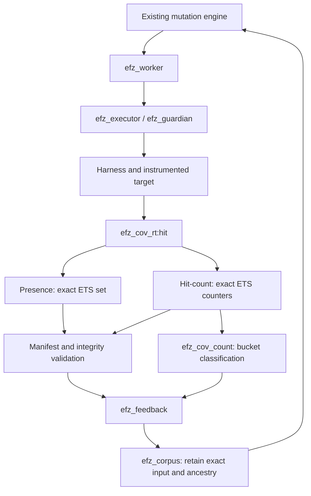

# EFZ: экспериментальный hit-count feedback

Дата: 15 сентября 2026. Baseline: `205e18ba172d74bd6c652a68abfc73e02e4a1f86`.
Прототип добавлен поверх exact probe-set реализации; default остаётся `presence`.
Сырьё измерений и команды приведены ниже. Это локальный эксперимент на трёх
небольших синтетических targets, а не доказательство эффективности на Erlang/OTP.

## Вывод

**RESULT B — hit-count feedback полезен для части targets и должен остаться opt-in.**

При 3000 mutation executions на campaign и трёх RNG seeds на target:
hit-count дошёл до глубокой ветки в 7 из 9 campaigns; presence — в 0 из 9.
Рост corpus в основном сравнении составил 2–3,5 раза (до 4,5 раза в отдельном
bucket saturation эксперименте). На фиксированном длинном loop полное время
executor увеличилось примерно на 7–8%; короткие исполнения определяются прежде
всего существующими lifecycle/integrity checks. Новых реальных bugs эксперимент
не доказывает: все три targets возвращают `deep`, unique crashes равны нулю.

Следующий практический шаг — повторить пары campaigns на настоящем parser с
известными глубокими состояниями, несколькими budgets и большим числом RNG seeds.
Оснований заменять default presence или внедрять dense bitmap пока нет.

## Контракт и runtime path

```erlang
#{coverage_feedback => presence}  % default
#{coverage_feedback => hit_count} % opt-in prototype
```

CLI: добавить `--coverage-feedback hit_count` к существующей команде
`scripts/fuzz.escript`. Unknown mode отклоняется config/CLI. `coverage_backend`
по-прежнему принимает `ets`/`ets_member`: это варианты presence hook; при
hit-count оба используют один exact ETS counter implementation.



Public identity не меняется: `{Module, BuildId, ProbeId}`. Это source
clause/outcome point, а не CFG edge. Нет `hash(Id) rem MAP_SIZE`, numeric bitmap
slots, collision aliasing или call-context hashing.

| State | Presence | Hit-count | Owner/lifetime |
|---|---|---|---|
| Per-input ETS object | `{{probe, Id}}` | `{{probe, Id}, Count}` | Guardian; fresh table каждого execution |
| Context backend field | ETS tid / `{ets_member,Tid}` | `{ets_count,Tid}` | Root и admitted descendants |
| Result `coverage` | Sorted exact identities | Та же проекция keys | Snapshot после termination всех admitted writers |
| Supplemental result | Нет | `hit_counts`, `count_features`, `coverage_feedback` | Обычные terms результата |
| Global probes | `feedback.global` | То же множество | Worker, одна campaign |
| Global count features | Нет | `feedback.global_features` | Worker, одна campaign |

`efz_cov_rt:hit/1` сохраняет проверку context через независимый registry. Для
hit-count вызывается `ets:update_counter(T,{probe,Id},{2,1},{{probe,Id},0})`.
Первый hit отправляет существующее уведомление guardian; каждый следующий
атомарно увеличивает integer. Проверено отсутствие 64-bit wrap для ETS: после
`2^63−1` получается `2^63`. Это не 8-bit AFL counter.

`efz_guardian` остаётся владельцем таблицы, start gates, monitors и cleanup.
`efz_executor:coverage/3` проверяет exact projection по прежнему manifest plan.
`efz_cov_count:snapshot/1` проверяет форму строк и положительные целые counters;
`features/2` требует точного совпадения ключей counts и `coverage`. Пропавшая
таблица, повреждённый context, отсутствующие/некорректные counts — infrastructure
failure, не успешное пустое наблюдение. Пустые `coverage=[]`, `hit_counts=#{}`
при целом context допустимы.

После подтверждённого cleanup таблица удаляется; следующая execution получает
новый ref и ETS. Controlled children используют ту же таблицу через прежний
`efz_target:spawn/1`; concurrent updates суммируются. Root crash/timeout не
удаляет owner-held таблицу раньше snapshot. Caller/guardian/dirty-runner policy
не менялась. Arbitrary async OTP application всё ещё вне supported model.

Это correctness contract для cooperating harness. Public ETS не security
boundary: произвольная запись другого **положительного** count напрямую в таблицу
не отличима от легального значения. Guardian independently witnesses presence,
но не дублирует каждый hit вторым счётчиком. Targets не должны менять EFZ rows.

## Buckets и novelty

| Count | Public bucket label |
|---|---:|
| 1 | 1 |
| 2–3 | 2 |
| 4–7 | 4 |
| 8–15 | 8 |
| 16–31 | 16 |
| 32–63 | 32 |
| 64–127 | 64 |
| 128+ | 128 |

Label — inclusive lower bound. Feature имеет вид `{ProbeIdentity, Bucket}`.
Zero hits не создают feature. Это заданные в запросе buckets; counter хранит
точную кратность, поэтому 256/1000/100000 не превращаются в zero из-за byte wrap.

В [efz_feedback](../src/efz_feedback.erl) для успешного исполнения:

```text
NewProbes   = CurrentProbes   − GlobalProbes
NewFeatures = CurrentFeatures − GlobalFeatures   # только hit_count
GlobalProbes   := GlobalProbes   ∪ CurrentProbes
GlobalFeatures := GlobalFeatures ∪ CurrentFeatures
```

| Execution X | New probes | New features | Retention в hit-count mode |
|---|---|---|---|
| X×1 | X | `{X,1}` | `new_probe` |
| X×2 | пусто | `{X,2}` | `new_hit_count` |
| X×3 | пусто | пусто | `equivalent_coverage`, не retain |
| X×4 | пусто | `{X,4}` | `new_hit_count` |

Если новый probe и bucket появились одновременно, причина `new_probe`, обе
дельты доступны в metadata. Default presence сохраняет старую причину
`new_coverage`. Calibration обновляет обе истории, но причина остаётся
`seed_calibration`. Crash/timeout не изменяют ни одно global множество;
infrastructure failure останавливает campaign. Worker принимает новое состояние
feedback только после успешной retention/storage операции.

Новая комбинация уже известных count features не является novelty. Сам hash
набора coverage, path signature и max count не используются для retention.

## Выбор представления после измерений

Исследованы пять вариантов в [storage benchmark](../bench/efz_hit_count_micro.erl):

1. Baseline ETS set через `insert_new`.
2. Sparse ETS counter через `update_counter/4`.
3. Collision-free prepared identity→slot ETS + `counters` `[atomics]`.
4. Та же mapping + `counters` `[write_concurrency]`.
5. Та же mapping + `atomics`.

Dense lookup включён в каждый hit; direct-slot-only результат не подставлялся
вместо стоимости hook. Identity→slot строится по перечислению manifest-like
identities, без hashing. Mapping allocation отдельно учитывается в setup/memory.
В реальной dense интеграции mapping можно готовить один раз на campaign; cold
setup здесь не следует интерпретировать как обязательную per-input стоимость.

| Представление | Lookup/update | Reset/snapshot | Concurrent access | Integration |
|---|---|---|---|---|
| ETS set | Exact key, insert-once | Sparse scan/delete | Atomic insert | Baseline |
| ETS counter | Exact key, atomic increment | Sparse scan/delete | Atomic integer increments | Сохраняет ETS owner и lifecycle |
| Dense counters/atomics | Exact mapping lookup + numeric index | В этом прототипе полный scan/reset слотов | Atomic counters; настройки имеют разные guarantees | Нужны mapping, lifetime refs, integrity/touched-slot strategy |

OTP `counters` и `atomics` используют 64-bit storage и допускают wrap;
`write_concurrency` меняет guarantees чтения при concurrent writes. Snapshot
после завершения writers избегает этого конкретного read/write overlap, но не
решает overflow. Их reference lifetime определяется достижимостью refs, а не
владельцем ETS. [OTP counters](https://www.erlang.org/docs/27/apps/erts/counters.html),
[OTP atomics](https://www.erlang.org/docs/27/apps/erts/atomics.html),
[OTP ETS update_counter](https://www.erlang.org/docs/27/apps/stdlib/ets.html#update_counter/4).

### Storage microbenchmark

Среда: OTP 27.0 / ERTS 15.0, Linux x86_64, Intel Core i7-1260P, `+S 4:4`.
Пять повторов после discarded warmup, порядок вариантов чередуется. Без CPU
pinning; частоты могут меняться. Synthetic identities имеют тот же полный формат,
но это **storage-only benchmark**, без guardian/integrity hook overhead.

Median ns/hit; `once` означает каждый из N probes один раз:

| N | ETS set | ETS counter | counters atomics | counters write_concurrency | atomics |
|---:|---:|---:|---:|---:|---:|
| 100 | 220 | 280 | 127 | 127 | 118 |
| 1000 | 257 | 314 | 133 | 133 | 125 |
| 10000 | 312 | 379 | 143 | 144 | 137 |
| 100000 | 469 | 595 | 196 | 222 | 187 |

Median ns/hit; `repeated` означает 10 probes ×1000 hits в пространстве N:

| N | ETS set | ETS counter | counters atomics | counters write_concurrency | atomics |
|---:|---:|---:|---:|---:|---:|
| 100 | 104 | 124 | 119 | 117 | 111 |
| 1000 | 105 | 128 | 117 | 120 | 113 |
| 10000 | 107 | 148 | 117 | 116 | 110 |
| 100000 | 123 | 147 | 125 | 137 | 113 |

При N=100000 и 10 observed probes snapshot ETS counter занял 18 мкс, dense
atomics — 38858 мкс; reset — 6 и 3578 мкс соответственно. При каждом probe один
раз dense atomics обновляется значительно быстрее, но snapshot занимает
257419 мкс против 192916 мкс у ETS counter. Четыре concurrent writers дали ровно
40000 hits во всех counter вариантах; это проверка atomicity, не benchmark
multi-worker EFZ. Campaign по-прежнему допускает только одного worker.

Memory и полный холодный storage lifecycle при N=100000:

| Variant | Bytes, все probes hit | Bytes, только 10 probes hit | Mapping bytes дополнительно | Total once, мс | Total repeated, мс |
|---|---:|---:|---:|---:|---:|
| ETS set | 16007352 | 3960 | 0 | 275,46 | 1,25 |
| ETS counter | 16807352 | 4040 | 0 | 276,81 | 1,51 |
| dense counters atomics | 800040 | 800040 | 14407352 | 368,86 | 156,86 |
| dense counters write_concurrency | 4000032 | 4000032 | 14407352 | 361,04 | 156,54 |
| dense atomics | 800040 | 800040 | 14407352 | 341,90 | 111,12 |

В totals входят setup, hit loop, snapshot, reset и close. Отдельно можно
амортизировать mapping setup: около 37–48 мс; это не устраняет полного
snapshot/reset scan. Dense storage сам по себе компактен, но точная mapping
в этом прототипе значительно больше массива. Он не претендует на оптимальный
layout mapping; измерение показывает стоимость конкретного работающего варианта.

Raw samples содержат `setup_ns`, `hit_ns`, `snapshot_ns`, `reset_ns`, `close_ns`,
`total_ns`, `storage_bytes`, `mapping_bytes`. Memory — bytes собственно storage
и mapping, **не peak всей VM**. `total_ns` — холодный storage lifecycle, а не
полный target execution. Малые batches на 100 probes чувствительны к timer/GC.
`close_ns` dense-вариантов измеряет удаление mapping ETS; освобождение counters/
atomics refs последующим GC отдельно не измерялось и в него не включено.

Для минимального production prototype выбран **sparse ETS counter**: он
поддерживает существующее владение, точные ключи, sparse snapshot и cleanup.
Dense counters без touched-slot tracking слишком дороги на большом редком
пространстве. Пять benchmark implementations сохранены для следующего сравнения.

### Полный executor на фиксированных inputs

Обычный instrumented repeat target; один и тот же input в обоих режимах.
Timer включает создание context, hooks, validation, snapshots, cleanup и DOWN.
Warmup, пять парных samples, 200 executions/sample для 1/1000 повторов и 10 для
100000. Это отдельная проверка overhead, без изменения corpus/scheduling.

| Повторы | Presence, мкс/input | Hit-count, мкс/input | Изменение |
|---:|---:|---:|---:|
| 1 | 4927,6 | 4910,1 | −0,4%, шум |
| 1000 | 5679,0 | 6092,3 | +7,3% |
| 100000 | 50367,3 | 54426,7 | +8,1% |

## Контролируемое fuzzing сравнение

Три targets — обычный source с automatic instrumentation, без ручных coverage
hooks. Benchmark adapter только сообщает timestamp результата `deep` наружу;
он не выбирает input/parent и не подменяет mutator.

| Target | Семантика | Глубокая ветка |
|---|---|---|
| [repeat](../fixtures/hit_count/efz_count_repeat.erl) | Prefix одинаковых `A` | ≥16 повторов |
| [records](../fixtures/hit_count/efz_count_records.erl) | Parser полных TLV-like records `1,1,Payload` | ≥8 records |
| [machine](../fixtures/hit_count/efz_count_machine.erl) | Переходы tick/ack `TA`, затем commit `C` | ≥8 пар до commit |

Каждая пара получает одинаковые initial seeds, все три RNG seeds, timeout=1000,
max_input_bytes=128, max_iterations=3000 и staged config:
`stages=[dictionary_insert,havoc]`, `havoc_depth=1`, `max_block_bytes=32`.
Dictionary содержит соответственно один byte/record/transition token, а не
готовые глубокие inputs. RNG rounds: mutation/random `{17*R,23,41}`, selection
`{101,109*R,113}`, R=1..3. Полные configs сохранены в evidence; драйвер проверяет
их равенство после удаления только `coverage_feedback`.

При росте corpus последующие input streams закономерно расходятся: проверяется
качество feedback, а не искусственно зафиксированная последовательность outputs.
Ни scripted mutator, ни новый fuzzing engine не используются.

| Target/mode | Final probes (R1/R2/R3) | Discoveries | Corpus | Count-only | Deep successes | Median exec/s |
|---|---|---|---|---|---:|---:|
| repeat / presence | 4/4/4 | 1/1/1 | 2/2/2 | 0/0/0 | 0/3 | 193,1 |
| repeat / hit_count | 5/5/5 | 6/6/6 | 7/7/7 | 4/4/4 | 3/3 | 190,9 |
| records / presence | 4/4/4 | 1/1/1 | 2/2/2 | 0/0/0 | 0/3 | 191,1 |
| records / hit_count | 4/4/5 | 3/3/5 | 4/4/6 | 2/2/3 | 1/3 | 191,7 |
| machine / presence | 5/5/5 | 2/2/2 | 3/3/3 | 0/0/0 | 0/3 | 194,6 |
| machine / hit_count | 6/6/6 | 6/8/7 | 7/9/8 | 3/5/4 | 3/3 | 183,6 |

Первый deep input в hit-count:

| Target | Mutation index R1/R2/R3 | Seconds от начала mutation phase |
|---|---|---|
| repeat | 2225 / 282 / 448 | 11,783 / 1,427 / 2,294 |
| records | не достигнут / не достигнут / 1645 | — / — / 8,671 |
| machine | 1319 / 1492 / 2298 | 7,439 / 8,713 / 10,501 |

Во всех 18 campaigns выполнено по 3000 executions, infrastructure failures=0,
unique crashes=0. Throughput campaigns включает другое распределение inputs,
больший corpus и scheduler work; его нельзя трактовать как изолированный cost
counter. Для этого выше приведён frozen-input executor experiment.

### Отрицательный контроль: random mutation

Ещё шесть campaigns получили тот же budget=3000, initial seeds и фиксированные
RNG states, но использовали существующий `efz_mutator_random`. Dictionary к нему
не добавлялся: этот mutator его не поддерживает. Результаты modes совпали по
coverage/discoveries/corpus; deep не достигнут ни в одном запуске:

| Target | Final probes, оба режима | Discoveries | Corpus | Count-only | Presence / hit-count exec/s |
|---|---:|---:|---:|---:|---:|
| repeat | 3 | 0 | 1 | 0 | 192,2 / 194,4 |
| records | 3 | 0 | 1 | 0 | 193,5 / 194,6 |
| machine | 4 | 1 | 2 | 0 | 194,1 / 205,2 |

У random mutator есть flip/overwrite/insert/delete, но нет dictionary/duplicate.
При пустом primary он всегда создаёт `<<0>>`. Без подходящего исходного content
feedback сам по себе не создаёт полезный input. Это существенное ограничение
обобщения положительных staged результатов.

### Большие loops и saturation corpus

Дополнительная настоящая staged campaign вставляла dictionary tokens
`L1,L2,L4,L8,L16,L32,L64,L128,L1000,L100000,L1000000` и вызывала один
автоматически instrumented probe соответствующее число раз. Trace проверен:
`L1000000` действительно был сгенерирован и исполнен в обоих modes.

| Mode | Executions | Status | Probes | Corpus | Count-only | Global bucket features |
|---|---:|---|---:|---:|---:|---:|
| presence | 38 | deterministic mutation exhaustion | 1 | 2 | 0 | — |
| hit_count | 256 | configured execution budget | 1 | 9 | 7 | 8 |

Presence исчерпал dictionary-only пространство раньше из-за меньшего corpus.
Этот опыт проверяет saturation/retention, **не сравнивает throughput при равных
executions**. Основная парная quality/performance таблица выше имеет равные budgets.
Counts 1000/100000/1000000 не сохранили дополнительные inputs после bucket 128.

## Corpus, совместимость и ограничения

Input, новый только по bucket, проходит прежний `efz_worker:retain` →
`efz_corpus:add` → `mutation_entries/select`. Metadata содержит обе delta и
точную причину. SHA-256 dedup, integer parent ID, primary bytes/hash и EFZR recipe
не меняются. Mode не входит в mutation config hash и не меняет operations.

Фактическая цепочка corpus в `repeat / hit_count / round 1`:

| ID | Input | Parent ID | Retention |
|---:|---|---:|---|
| 1 | `<<>>` | — | initial |
| 2 | `A` | 1 | `new_probe` |
| 3 | `AA` | 2 | `new_hit_count` |
| 4 | `AAAA` | 3 | `new_hit_count` |
| 5 | `AAAAAAAA` | 4 | `new_hit_count` |
| 6 | `AAAAAAAAAAAAAAAA` | 5 | `new_probe`, deep branch |
| 7 | 32 × `A` | 6 | `new_hit_count` |

В regression campaign `L2` получил ID 5, `parent=1`, `new_probes=[]` и
`new_count_features=[{{efz_count_sites,Build,1},2}]`. Последующая настоящая
recipe имеет `parent=5`, `primary=<<"L2">>`, `primary_id=SHA256(<<"L2">>)`,
`operations=[{dictionary_insert,0,<<"L1">>}]` и восстанавливает `<<"L1L2">>`.
Этот следующий input не обязан быть interesting: тест доказывает именно
scheduler reuse. Полезная многошаговая count ancestry показана в таблице выше.
В новом VM queue IDs назначаются заново; restore test ищет parent по content.

Durable store сохраняет count discoveries в record schema 2; initial/presence
entries остаются schema 1. Envelope EFZC остаётся version 1. Старые records
читаются; старый EFZ отклонит новые v2 records. Raw inputs можно переносить между
modes с повторной calibration; global bucket history и cursor не восстанавливаются.
Подробности: [corpus contract](corpus.md).

Crash input и recipe остаются authoritative bytes/provenance; replay использует
те же build/harness checks. Default replay проверяет outcome, не воспроизводит
count novelty: для этого понадобилась бы история конкретной campaign. Identity,
manifest и recipe schemas не менялись. Count mode не обходит guardian или input
limits, не добавляет parallel campaigns и не очищает arbitrary VM-global state.

В фиксированном build у probe всего восемь возможных bucket features. После
первого наблюдения остаётся максимум семь count-only возможностей на probe.
Следовательно, число count-only retentions ограничено `7 * число probes`
(фактически меньше из-за calibration, нескольких features/input и content dedup).
Комбинации features не перемножают это пространство. Это не ограничение total
initial/restored corpus и не гарантия малого объёма recipes при больших inputs.

Уже действуют opt-in, buckets и dedup. Новые hard caps/power schedules не добавлены:
на этих targets corpus мал. Для больших manifests следует отдельно измерить
retained bytes/recipe bytes; только затем выбирать cap count-only discoveries
или меньший scheduling priority для них. Dense mapping/touched slots — возможная
оптимизация после профилирования, а не необходимое условие новой семантики.

## Воспроизведение и evidence

Из корня `efz/`, последовательно, без concurrent test/benchmark workloads:

```sh
ERL_FLAGS='+S 4:4' rebar3 compile
escript bench/hit_count.escript micro _build/hit-count-experiment
escript bench/hit_count.escript executor _build/hit-count-experiment
escript bench/hit_count.escript campaign _build/hit-count-experiment
escript bench/hit_count.escript stress _build/hit-count-experiment
escript bench/hit_count.escript large_loops _build/hit-count-experiment
escript bench/hit_count.escript report _build/hit-count-experiment

ERL_FLAGS='+S 4:4' rebar3 eunit
ERL_FLAGS='+S 4:4' rebar3 ct
ERL_FLAGS='+S 4:4' rebar3 xref
ERL_FLAGS='+S 4:4' rebar3 dialyzer
```

Полные reports/recipes и текстовые logs остаются в `_build/hit-count-experiment`.
Компактный архив всех samples: [hit-count-samples.json](performance/hit-count-samples.json).
Erlang tuples представлены JSON arrays, binary — объектами `{hex: ...}`;
`features` в campaign rows — количество features, сами exact IDs есть в coverage.

Regression suite: [efz_hit_count_tests](../test/efz_hit_count_tests.erl), дополнения
в CLI, integrity и corpus-store tests. Проверяются все bucket boundaries,
presence ×1/×1000, multi-probe delta, namespaces builds, concurrent child hits,
crash/timeout snapshots, corrupted counts/context, default/invalid config,
real staged retention и parent reuse, durable restore/recalibration в свежей VM,
raw+recipe crash replay и build/harness mismatch.

Фактическая итоговая проверка:

| Команда с `ERL_FLAGS='+S 4:4'` | Результат |
|---|---|
| `rebar3 compile` | PASS |
| `rebar3 eunit` | PASS, 199 tests |
| `rebar3 ct` | PASS, 3 tests |
| `rebar3 xref` | PASS |
| `rebar3 dialyzer` | PASS |

Первые EUnit попытки не были успешными: старый test на 5376 guarded executions
превысил `efz:await(25000)` (и следующий smoke получил 0 executions); во второй
попытке default 5-second EUnit timeout отменил группу из восьми campaigns.
Функциональные assertions сохранены: ожидание первого теста увеличено до 60 s
(outer 75 s), второго — до 30 s. Target timeout и mutation budget не менялись.
Последняя полная EUnit попытка прошла без failures/cancellations; exhaustion
test занял 33,621 s и подтвердил ровно 5120 mutation executions.
Исходные failure logs и обе попытки validation сохранены, а не заменены успехом
в архиве provenance. Полные logs — `_build/hit-count-experiment/`.
